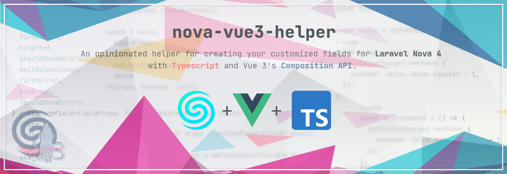

# Nova Vue 3 Helper


> An opinionated helper for creating your customized fields for Laravel Nova 4 with Typescript and Vue 3's Composition API.

If you want to speed up the implementation of your custom Nova field, also check out our [squidlab-it/nova-field-template](https://github.com/squidlab-it/nova-field-template) repository for a production-ready template.

# Setup

## 1. Install
To install this package, execute the following command in the root of your custom field:
```bash
yarn add @squidlab/nova-vue3-helper
```
OR
```bash
npm install @squidlab/nova-vue3-helper
```

## 2. Declare globals
Create a `globals.d.ts` in the root of your javascript folder with this content:
```typescript
import { Nova as NovaType } from '@squidlab/nova-vue3-helper';

declare global {
  const Nova: NovaType;
}
```
This allows you to use Nova utils such as [Nova.request](https://nova.laravel.com/docs/4.0/customization/frontend.html#nova-requests), [Nova.visit](https://nova.laravel.com/docs/4.0/customization/frontend.html#manual-navigation), [Nova's event bus](https://nova.laravel.com/docs/4.0/customization/frontend.html#event-bus), [global variables](https://nova.laravel.com/docs/4.0/customization/frontend.html#global-variables), etc, in a typed way.

# General purpose composables

Some of the provided composables are generic and can be used in tools, fields, filters or cards.

---

#### useLocalization
Typescript version of the original [useLocalization](https://nova.laravel.com/docs/4.0/customization/localization.html#frontend) in Laravel Nova.

```typescript
const { __ } = useLocalization();

const translatedString = __('counter.increment');
```

---

#### useTheme
Utility, gives you the current theme (`light` or `dark`) so that you can update your component accordingly.

```typescript
const currentTheme = useTheme(); // the current theme ('light' or 'dark')
```

---

# Creating custom fields

## 1. Define types

To work with your field with types, you'll have to define three different specific types:

- The type of the (hydrated) internal value: the type of data your field will handle;
- The type of the dehydrated value: the type of data that your field will receive from the backend. Usually a `string`, but it depends on your resolve callbacks of your field, the serialization method (`jsonSerialize()`) of your field, and also on the casts applied by the model (e.g., if the model is casting the corresponding attribute to a json object);
- The type of the field: by extending `Field<DehydratedValue>` (where `DehydratedValue` is the dehydrated value defined in the previous step), which includes all the other standard values that belong to each field, you can set additional metadata that is sent to the field, for example by using `withMeta()` method or by additional data appended in the `jsonSerialize()` method;
- The props of the field: by extending `FieldProps<Field>` (where `Field` is the type of the field defined in the previous step), you can set the type of props that are sent to the vue component of the field. If you're not changing Nova's internal behaviour, there are no easy/common way to add additional custom props, so you usually don't have to add other properties here.

### 1.1 Example
Let's suppose we implemented a field `Counter` that acts as a simple counter. Our field saves in the DB the count value as a json object like `{ "counter": 10 }`. In the model we're **not** casting the value to `array`, and in our field's `resolve()` method we're not de-serializing the value, so our Vue field will receive the data as string (`"{ \"counter\": 10 }"`). Our field defines also two methods `allowIncrement(bool $allowed =  true)` and `allowDecrement(bool $allowed =  true)`, which allow us to define if the field should show respectively a "plus" and a "minus" buttons to increment and decrement the counter, by adding meta to the field.

The PHP code of this field could be like:

```php
<?php

namespace SquidLab\Counter;

use Laravel\Nova\Fields\SupportsDependentFields;
use Laravel\Nova\Fields\Field;

class Counter extends Field {
    use SupportsDependentFields;
    
    public $component = 'counter';
    
    public function allowIncrement(bool $allowed = true): static
    {
        return $this->withMeta([
            'allowIncrement' => $allowed,
        ]);
    }
    
    public function allowDecrement(bool $allowed = true): static
    {
        return $this->withMeta([
            'allowDecrement' => $allowed,
        ]);
    }
}
```

We define those 4 types:
```typescript
import { Field, FieldProps } from '@squidlab/nova-vue3-helper';

export interface YourValue {
    counter: number;
}

export type YourDehydratedValue = string;

export interface YourField extends Field<YourDehydratedValue> {
    allowIncrement: boolean;
    allowDecrement: boolean;
}

export type YourFieldProps = FieldProps<YourField>;
```

## 2. Define field
Our Nova 4 fields are composed by 3 different components:

- Index component: Used in the index view of the resource
- Detail component: Used in the details view of the resource
- Form component: Used in the update/create view of the resource

The purpose of this package is to provide to the three components an easy way to work with:
- the field's props,
- the resolved value,
- the internal value (which can change by the user inputs),
- the submission of the new value,
- Nova's events (e.g., for dependent fields changes),

To achieve that, are available to the developers several composables that can be used in your components. Obviously you can choose which are useful and which are not depending on your needs. There are some higher level composables which are meant to be used for common easy fields which are working in a "standard" way. But if you need more granular control you can use the lower level composables (which are the same used by the higher level ones) and build your field as you want.

### 2.1 Props

To obtain the field props, you can use `defineProps` from vue by using the props type that you've defined before.

For example:
```typescript
const props = defineProps<YourFieldProps>();
``` 

### 2.2 Events

To define the emit function needed for emitting specific events used by Nova to handle your field, you can use `defineEmits` from vue by using the emit type provided in this package.

For example:
```typescript
import type { FieldEmitFn } from '@squidlab/nova-vue3-helper';

const emit = defineEmits<FieldEmitFn>();
``` 

## 3. High-level Composables

Here's a list of the available composables that are abstractions of several other lower-level composables. They're ready to be used as-is without much tinkering, and are "all-inclusive". 99% of the times you should just use these, but if you're developing something more complex, or you need more granular control, you can use instead the lower-level composables with all the personalization you need.

---

#### useFormField
Higher level composable, which uses several other composables described here to simplify the development of "standard" **form** components.

```typescript
const {
  value, // the current internal (hydrated) value
  currentField, // current field (synced with changes triggered by dependent fields)
  fieldLabel, // the label of the field
  helpText, // help text to be shown under the field's input
  shouldShowHelpText, // boolean that indicates if the help text has to be shown
  emitValueChange, // call this method when the user is interacting with the input to update the field's internal value
  errors, // array of error messages of this field
  firstError, // the first of the error messages
  hasError, // boolean that indicates if there are errors associated with this field
  shouldShowErrors, // boolean that indicates if the error messages have to be shown
} = useFormField<YourFieldProps, YourField, YourDehydratedValue, YourValue>(
  props, // props of the field component
  // hydrate function, takes the dehydrated field.value and transforms it to the internal value 
  (field) =>
    (JSON.parse(field.value ?? 'null') as YourValue | null) ?? {
      counter: 0,
    },
  // dehydrate function, takes the hydrated value and de-hydrate it before sending it in the FormData of the saving request and in the attribute change event
  (value) => {
    return JSON.stringify(value || {});
  },
  emit, // emit function used to emit component's events
  fieldName, // optional, reference to a string used to override the field label
  showErrors, // optional, reference to a boolean used to indicate if the errors have to be shown or not
  // optional, callback used to fill the FormData of the saving request with additional data
  (formData) => {
    // manipulate formData as you need
  }
);
```

---

#### useDetailField
Higher level composable, which uses several other composables described here to simplify the development of "standard" **detail** components.

```typescript
const {
  value, // the current internal (hydrated) value
  fieldLabel, // the label of the field
} = useDetailField<YourFieldProps, YourField, YourDehydratedValue, YourValue>(
  props, // props of the field component
  // hydrate function, takes the dehydrated field.value and transforms it to the internal value 
  (field) =>
    (JSON.parse(field.value ?? 'null') as YourValue | null) ?? {
      counter: 0,
    },
  emit, // emit function used to emit component's events
  fieldName, // optional, reference to a string used to override the field label
);
```

---

#### useIndexField
Higher level composable, which uses several other composables described here to simplify the development of "standard" **index** components.

```typescript
const {
  value, // the current internal (hydrated) value
} = useIndexField<YourFieldProps, YourField, YourDehydratedValue, YourValue>(
  props, // props of the field component
  // hydrate function, takes the dehydrated field.value and transforms it to the internal value 
  (field) =>
    (JSON.parse(field.value ?? 'null') as YourValue | null) ?? {
      counter: 0,
    },
);
```

---

### 3.1 Example

Taking the [example 1.1](#11-example) as base, here is an example on how the javascript part of the **form** component could be implemented:

```typescript
import { defineProps, ref } from 'vue';
import type { FieldEmitFn } from '@squidlab/nova-vue3-helper';
import { useFormField, useLocalization } from '@squidlab/nova-vue3-helper';
import { config } from '@/config';
import { FieldProps } from '@/types/field-props';
import { Value } from '@/types/value';
import { DehydratedValue } from '@/types/dehydrated-value';
import { Field } from '@/types/field';

const { __ } = useLocalization();

const props = defineProps<FieldProps>();

const emit = defineEmits<FieldEmitFn>();

const {
  value,
  currentField,
  fieldLabel,
  helpText,
  shouldShowHelpText,
  emitValueChange,
  firstError,
  hasError,
  shouldShowErrors,
} = useFormField<FieldProps, Field, DehydratedValue, Value>(
  props,
  // hydrate function
  (field) =>
    (JSON.parse(field.value) as Value | null) ?? {
      counter: 0,
    },
  // de-hydrate function
  (value) => {
    return JSON.stringify(value || {});
  },
  emit
);

const input = ref<HTMLInputElement>();

const getInputValue = () => {
  let str = input.value?.value ?? '0';
  str = str.replaceAll(/[^0-9]+/g, '');
  const num = parseInt(str, 10);
  if (isNaN(num)) {
    return 0;
  }
  return num;
};

const onDecrementClick = () => {
  emitValueChange({
    counter: getInputValue() - 1,
  });
};
const onIncrementClick = () => {
  emitValueChange({
    counter: getInputValue() + 1,
  });
};
const onInputChange = () => {
  emitValueChange({
    counter: getInputValue(),
  });
};
```

## 4. Low-level Composables

Here's a list of the low-level (of abstraction) composables. If you're developing something more complex, or you need more granular control, you can use these instead of the "all-inclusive" high-level composables.

---

#### useFieldFill
This composable watches the field for changes (for example, if the field is changed by a sync due to a changes of another dependent attribute) and, when needed, sets the fill callback.

```typescript
useFieldFill<YourField>(
  currentField, // current field (synced with changes triggered by dependent fields)
  // fill method
  (formData) => {
    if (currentField.value.visible) {
        formData.append(
          currentField.value.attribute, // attribute name 
          dehydrate(value.value) // serializes the internal value into the dehydrated value
        );
    }
});
```

---

#### useFieldLabel
Used to obtain the field's label.

```typescript
const {
  fieldLabel, // the label of the field
} = useFieldLabel<YourField>(
  currentField, // current field (synced with changes triggered by dependent fields)
  fieldName, // optional, reference to a string used to override the field label
);
```

---

#### useFieldHelpText
Used to obtain the field's help text.

```typescript
const {
  helpText, // help text to be shown under the field's input
  shouldShowHelpText, // boolean that indicates if the help text has to be shown
} = useFieldHelpText<YourField>(
    showHelpText, // reference to a boolean used to indicate if the help text has to be shown or not, usually taken from props.showHelpText
    currentField, // current field (synced with changes triggered by dependent fields)
);
```

---

#### useFieldValidationErrors
Used to obtain the field's errors.

```typescript
const {
  errors, // array of error messages of this field
  firstError, // the first of the error messages
  hasError, // boolean that indicates if there are errors associated with this field
  shouldShowErrors, // boolean that indicates if the error messages have to be shown
} = useFieldValidationErrors<YourField>(
  errors, // all the errors, usually taken from props.errors
  currentField, // current field (synced with changes triggered by dependent fields)
  showErrors // optional, reference to a boolean used to indicate if the errors have to be shown or not
);
```

---

#### useFieldValue
Used to easily manage the field's internal value.

```typescript
const formUniqueId = computed(() => props.formUniqueId); // form unique id of the field 

const {
  value, // the current internal (hydrated) value
  emitValueChange, // call this method when the user is interacting with the input to update the field's internal value
} = useFieldValue<YourField, YourValue, YourDehydratedValue>(
    currentField, // current field (synced with changes triggered by dependent fields)
    formUniqueId,
    // hydrate function, takes the dehydrated field.value and transforms it to the internal value 
    (field) =>
        (JSON.parse(field.value ?? 'null') as YourValue | null) ?? {
            counter: 0,
        },
    // dehydrate function, takes the hydrated value and de-hydrate it before sending it in the attribute change event.
    (value) => {
        return JSON.stringify(value || {});
    },
);
```

---

#### useFieldAttributeEventName
Get the attribute's event names used internally in Nova for signaling value changes and for dependent fields syncing.

```typescript
const attribute = computed(() => currentField.value.attribute); // attribute name
const formUniqueId = computed(() => props.formUniqueId); // form unique id of the field 

const valueEventName = useFieldAttributeEventName(
  attribute,
  'value',
  formUniqueId, 
);
const changeEventName = useFieldAttributeEventName(
  attribute,
  'change',
  formUniqueId,
);
```

---

#### useFieldChangeEvent
The change event is used by other attributes that [depend on](https://nova.laravel.com/docs/4.0/resources/fields.html#dependent-fields) the current attribute to update their fields accordingly to the value changes.

```typescript
const attribute = computed(() => currentField.value.attribute); // attribute name
const formUniqueId = computed(() => props.formUniqueId); // form unique id of the field 

const {
  emitFieldValueChange // to be called when the internal value is changed
} = useFieldChangeEvent<YourDehydratedValue>(
  attribute,
  formUniqueId
);

watch(
  () => currentValue.value, // current internal value
  (newValue, oldValue) => {
    if (newValue !== oldValue) {
      emitFieldValueChange(
        dehydrate(newValue) // dehydrate function, takes the hydrated value and de-hydrate it before sending it in the attribute change event.
      );
    }
  }
);
```

---

#### useFieldValueEvent
The value event is used to update the field's internal value.

```typescript
const attribute = computed(() => currentField.value.attribute); // attribute name
const formUniqueId = computed(() => props.formUniqueId); // form unique id of the field
const currentValue = ref<YourValue|null>(null);

const { emitValueChange } = useFieldValueEvent<YourValue>(
    attribute,
    formUniqueId,
    // optional, callback executed when the event occurs
    (newValue) => {
        currentValue.value = newValue;
    }
);

const onInputChange = (event: Event) => {
    const newValue = parseInt(event.target , 10);
    emitValueChange({
        counter: isNaN(newValue) ? 0 : newValue,
    });
};
```

---

#### useFieldVisibilityEvent
The visibility event is used by panels to indicate if the panel has to be visible or not (if a panel has no visible fields, it's hidden).

```typescript
const attribute = computed(() => currentField.value.attribute); // attribute name
const visible = computed(() => currentField.value.visible); // current field's visibility

const emit = defineEmits<EmitFn>();

useFieldVisibilityEvent(
  emit,
  attribute,
  visible,
);
```

---

#### useDependentFormField
This composable handles the sync of the field depending on other attributes on the form. In other words, it responds to changes of [dependent fields](https://nova.laravel.com/docs/4.0/resources/fields.html#dependent-fields) by updating the current field accordingly. It requires several properties that are given directly from the component props.

```typescript
const {
    field,
    formUniqueId,
    resourceName,
    resourceId,
    viaRelationship,
    viaResource,
    viaResourceId,
    relatedResourceName,
    relatedResourceId,
    syncEndpoint,
} = toRefs(props);

const { 
  currentField // the updated field 
} = useDependentFormField<YourField, YourValue, YourDehydratedValue>(
    value, // current internal value
    initialValue, // initial value of the field
    dehydrate, // dehydrate function, takes the hydrated value and serializes it to be sent in the sync request
    field, // from props
    formUniqueId, // from props
    resourceName, // from props
    resourceId, // from props
    viaRelationship, // from props
    viaResource, // from props
    viaResourceId, // from props
    relatedResourceName, // from props
    relatedResourceId, // from props
    syncEndpoint // from props
);
```

---

#### useFormEditMode
Check if the current form is a `create`, `update`, `attach`, `update-attach` form, and if it's regarding a pivot table.

```typescript
const {
    resourceId,
    relatedResourceName,
    relatedResourceId,
} = toRefs(props);

const {
  editMode, // 'create', 'update', 'attach' or 'update-attached' depending on the current form  
  pivot // boolean, true if attaching in a many-to-many relation (if editMode is 'attach' or 'update-attached')
} = useFormEditMode(
    resourceId,
    relatedResourceName,
    relatedResourceId
);
```

---
